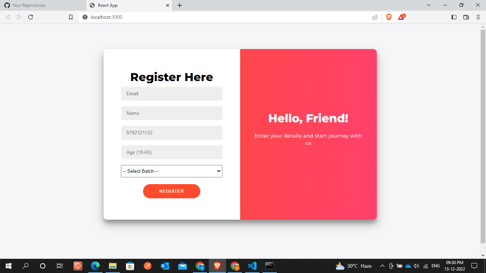
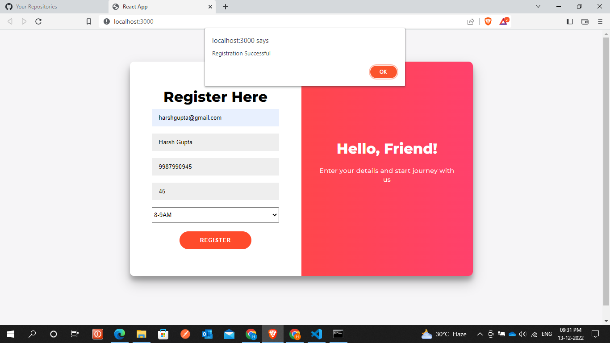
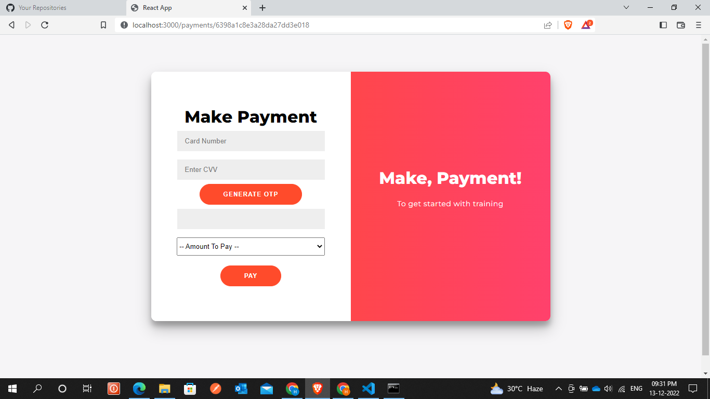
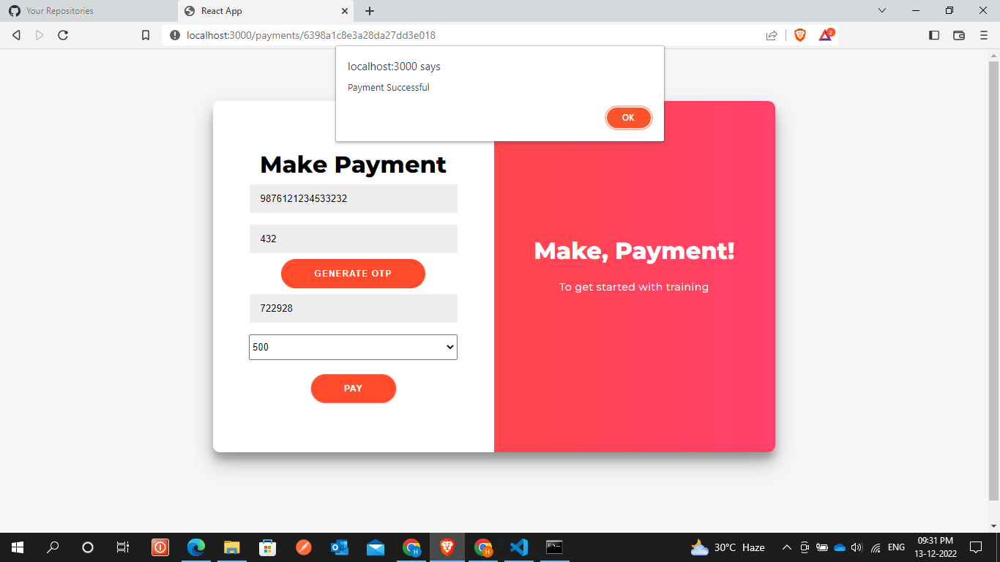

 

  <h1 align="center">
    <b>FlexMoney - Assessment</b>
  </h1>

## About The Project

This project is build as a part of flexmoney assessment. I have designed a form which accepts details of a user and register them for yoga classes. After registration is completed I have added a feature of dummy payment which is basically a form accepting certain details and storing the details. So if user wants to register for yoga classes he can register for classes anyday of a month and for exactly one month. Also if user wants he/she can change the batch timings for next month while registering.

## Project Images
#### Register Page

#### Payments page

## Technologies Used

1. MongoDB (as Database)
2. ExpressJS (as BackEnd framework for creating routes)
3. ReactJS (as FrontEnd Library)
4. NodeJS (as JavaScript Runtime Environment)
## Assumptions Made

1. I have assumed months to be of 30 days.
2. Phone number to be of 10 digits.
3. Credit Card No. to be of 16 digits. 
4. Age between (18-65) as provided.
5. OTP of 6 digits.

(<a href="#top">back to top</a>)

